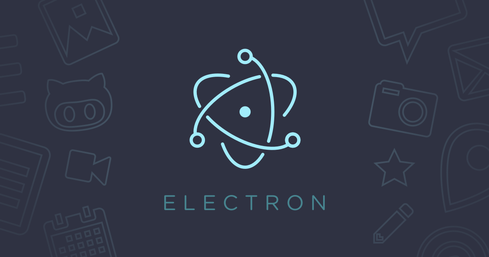

# Создание проекта на Electron



**Создание приложения на Electron** — это отличный способ сделать кросс-платформенные настольные приложения с использованием веб-технологий.


**Пошаговое руководство по созданию простого приложения на Electron:**

## Установка Node.js

Сначала убедитесь, что у вас установлен **Node.js**.

Вы можете скачать его с [официального сайта](https://nodejs.org/en).

## Создание проекта

1. **Создайте новую папку для вашего проекта и перейдите в неё:**

```bash
mkdir my-electron-app
cd my-electron-app
```

2. **Инициализируйте новый проект npm:**

```bash
npm init -y
```

## Установка Electron

**Установите Electron в ваш проект:**

```bash
npm install electron --save-dev
```

**Установите Electron Store:**

```bash
npm install electron-store
```

**Очистка кеша:**

```bash
npm cache clean --force
```

## Создание файловой структуры

**Создайте следующие файлы и папки:**

```bash
my-electron-app/
│
├── main.js        # Главный файл приложения
├── index.html     # HTML-шаблон
├── renderer.js    # Скрипт для интерфейса
├── styles.css     # Стили для приложения
├── settings.js    # Настройки приложения
└── package.json   # Файл конфигурации проекта
```

```bash
my-electron-project/
│
├── app/
│   ├── main/
│   │   ├── main.js            # Основной файл приложения
│   │   ├── menu.js            # Файл для создания меню
│   │   ├── logger.js          # Логирование
│   │   └── store.js           # Хранение настроек
│   │
│   ├── renderer/
│   │   ├── index.html         # HTML интерфейса
│   │   ├── renderer.js        # Логика интерфейса
│   │   └── styles.css         # Стили интерфейса
│   │
│   └── assets/                # Папка для изображений и иконок
│       └── icon.png           # Иконка приложения
│
├── package.json               # Настройки проекта
├── preload.js                 # Предзагружаемый скрипт
└── .gitignore                 # Игнорируемые файлы
```

## Настройка main.js

**В файле main.js создайте основной процесс приложения:**

```javascript
const { app, BrowserWindow } = require('electron');

function createWindow() {
    const win = new BrowserWindow({
        width: 800,
        height: 600,
        webPreferences: {
            nodeIntegration: true,
        },
    });

    win.loadFile('index.html');
}

app.whenReady().then(createWindow);

app.on('window-all-closed', () => {
    if (process.platform !== 'darwin') {
        app.quit();
    }
});

app.on('activate', () => {
    if (BrowserWindow.getAllWindows().length === 0) {
        createWindow();
    }
});
```

## Создание index.html

**Создайте файл index.html с простым содержимым:**

```html
<!DOCTYPE html>
<html lang="en">
<head>
    <meta charset="UTF-8">
    <meta name="viewport" content="width=device-width, initial-scale=1.0">
    <title>My Electron App</title>
</head>
<body>
    <h1>Welcome to My Electron App</h1>
    <p>This is a simple Electron application.</p>
</body>
</html>
```

## Обновление package.json

**Добавьте скрипт для запуска приложения в ваш package.json:**

```json
"scripts": {
    "start": "electron ."
}
```

## Запуск приложения

**Теперь вы можете запустить ваше приложение с помощью следующей команды:**

```bash
npm start
```

## Дальнейшие шаги

Теперь у вас есть простое приложение на **Electron**.

**Вы можете добавлять новые функции, такие как:**

- **Меню:** Используйте Menu API для создания меню приложения.
- **Диалоговые окна:** Используйте dialog для отображения сообщений и выбора файлов.
- **Стилизация:** Добавьте CSS и JS для улучшения интерфейса.
- **Модули:** Используйте дополнительные модули, такие как electron-store для хранения настроек.

## Полезные ссылки

- [Документация Electron](https://www.electronjs.org/ru/docs/latest/)

- [Примеры приложений на Electron](https://github.com/electron/electron/tree/main/docs/tutorial)


**Автор:** Дуплей Максим Игоревич

**Дата:** 06.10.2024

**Версия:** 1.0
